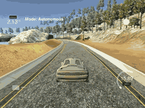
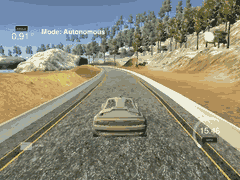
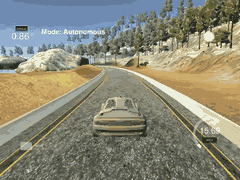

# PID Control Project

This repository contains my solution for the project "PID Control Project" of the Udacity Self-Driving Car Engineer Nanodegree Program. A description of a basic setup can be found in the [original repository](https://github.com/udacity/CarND-PID-Control-Project). The written code could be found in the files [main.cpp](./src/main.cpp)an  [PID.cpp](./src/PID.cpp).

The following part of the README contains a very short writeup which describes what is done.

---

In this project a PID controller is implemented to drive a car around a track in a simulator. A given CTE error is used to predict a good steering angle with the aim to minimize the CTE error.

In the file [PID.cpp](./src/PID.cpp) the PID controller is implemented using the parameters `Kp`, `Ki` and `Kd` to calculate the steering angle. While the implementation is very simple finding good parameters takes some time.

The `Kp` parameter describes how strong we correct the steering angle based on the CTE. Choosing it higher the car starts to oscillate. This can be seen in the following GIF where the `Ki` and `Kd` parameters are set to zero.

The `Kd` parameter describes how strong we correct the steering angle based on the difference of the previous and the on the current CTE. Choosing it higher the oscillating gets softer until it stops but the car reacts not as fast on the CTE error as before. Using the `Kp` and `Kd` parameter can be seen in the following GIF.

Finally the `Ki` parameter describes how strong the controller reacts on the sum of all errors. This again smooths the driving a bit but the `Ki` parameter is not that important. Using all parameters together is shown in the following GIF.

Choosing the parameters can be a bit tricky. The car never drives perfectly around the track and a decision must be made between oscillating and driving sharp curves. To find good parameters the twiddle algorithm is implemented. In the file [main.cpp](./src/main.cpp) we start a run with some starting parameters, calculate the overall sum of CTE errors, reset the simulator, change the parameters according to twiddle and start the next run. With the aim to minimize the sum of CTE errors this implementation tries to find good parameters for `Kp`, `Ki` and `Kd`.
The final parameters are `Kp=0.24`, `Ki=0.0012` and `Kd=3.6`.

# Build & Run

### Dependencies

* cmake >= 3.5
* make >= 4.1 (Linux, Mac), 3.81 (Windows)
* gcc/g++ >= 5.4

### Basic Build Instructions

1. Clone this repo.
2. Make a build directory: `mkdir build && cd build`
3. Compile: `cmake .. && make`
4. Run it: `./pid`
